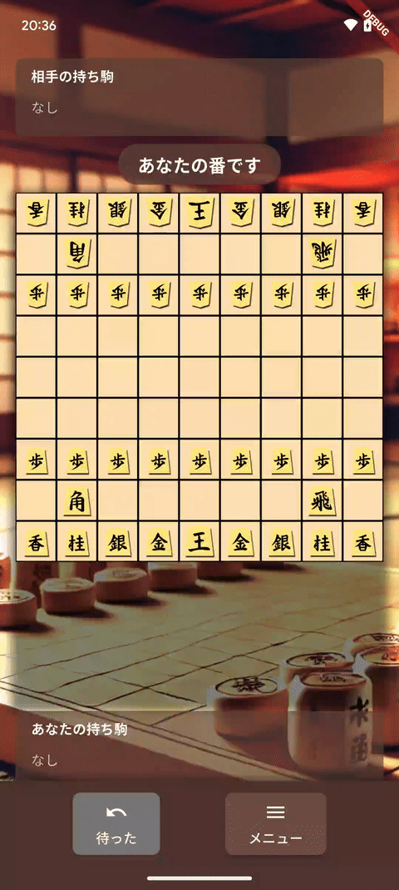
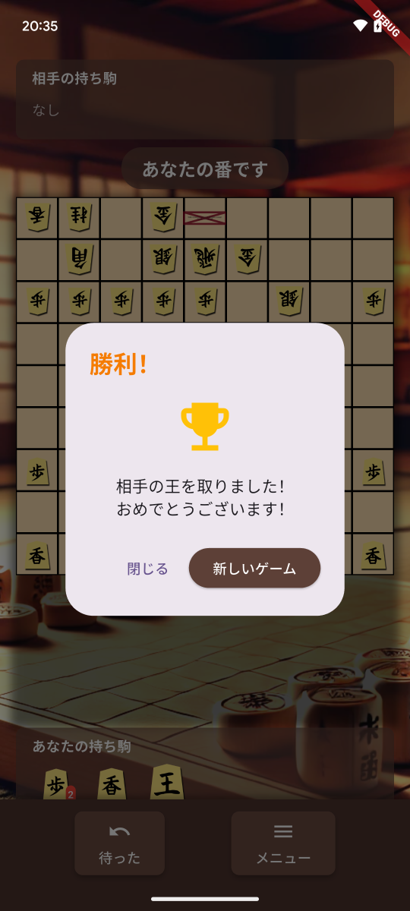

# 将棋アプリ

Flutterで開発した将棋ゲームアプリです。コンピュータAIを搭載し、モバイルデバイスで遊べる和風テイストの将棋アプリケーションです。

## デモ



スクリーンショット:

 

## 主な機能

- 9x9の本格的な将棋盤と駒の実装
- シンプルなAIによるコンピュータプレイヤー
- 持ち駒機能
- 「成り」機能（相手陣地で駒が裏返る）
- 「待った」機能（複数手を遡れる）
- 和風な背景画像

## 開発環境

- Flutter 3.x
- Dart 3.x
- 開発プラットフォーム: Android/iOS

## インストール方法

```bash
# リポジトリをクローン
git clone https://github.com/yourusername/shogi_app.git

# 依存関係のインストール
cd shogi_app
flutter pub get

# アプリを実行
flutter run
```

## 使い方

1. アプリを起動すると将棋盤が表示されます
2. プレイヤーは黒駒（下側）を操作できます
3. 駒をタップして選択し、移動可能なマスに移動させます
4. 相手の駒を取ると持ち駒になります
5. 持ち駒は画面下部から選択して盤上に打つことができます
6. 相手の玉（王将）を詰ませると勝利です

## ライセンスと著作権

© 2023-2024 All Rights Reserved.

このプロジェクトは**GPL-3.0ライセンス**の下で公開されています。

### 使用条件:
1. このアプリケーションは個人的な学習およびレビュー目的でのみ使用できます
2. 商用利用は明示的に禁止されています
3. 派生物を作成する場合は同じライセンスを適用し、元の著作権表示を維持する必要があります
4. 無断での再配布は禁止されています

詳細はLICENSEファイルをご覧ください。
